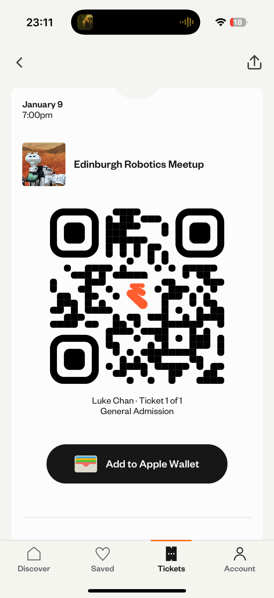

# 25-01-10 Robotic_meetup

## What I have done
- I went to the Edinburgh robotic meet up last night with friends to present our autonomous driving software hoping we could get some ideas from people there. The attendees to the event were mostly lecturers and senior robotic engineers. However, they shown a lot of interst in our software, asked intesting questions and gave us many things we could improve on. For example we should attempt to sync the publish frequency of camera and Lidar so we could use sensor fusion for these topics. 
- I also did some networking in the event.

## Reflection
Before attending the meet up I was very nervous, because I thought it will be a formal conference. But it actually happended in golf tarvent and it was just a social even for peoplr to share their projects, in a local pub. The atmophere were very chilled, and the people there were very welcoming. I think the original reconition I had for this kind of community are that people here will be very serious and talk strictly about their academic or research achievement, I was afraid that i would nor fit-in. but turns out it was not the case at all.

## What am I going to do?
I think the fear i had to attend these event were pure imaginary. This experience tought be do not make any assumption before experiencing it.